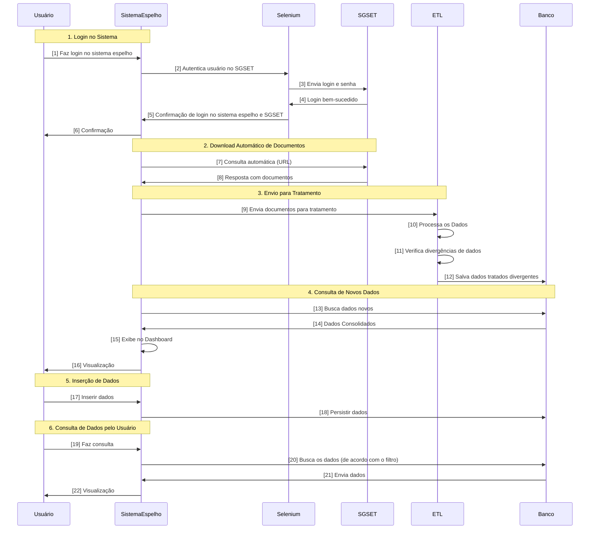
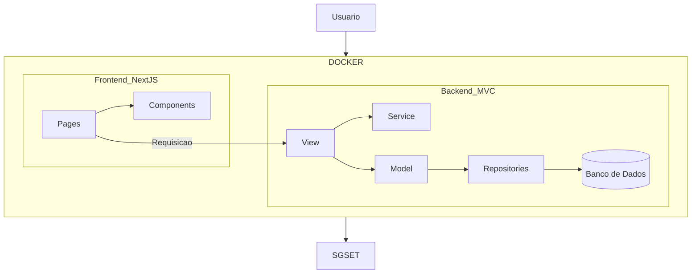

# Diagramas de Engenharia de Software

## 1 Diagrama de Processos

```mermaid
sequenceDiagram
    participant Usuário
    participant SistemaEspelho
    participant Selenium
    participant SGSET
    participant ETL
    participant Banco

    %% 1 - Login no Sistema
    Note over Usuário,SistemaEspelho: 1. Login no Sistema
    Usuário ->> SistemaEspelho: [1] Faz login no sistema espelho
    SistemaEspelho ->> Selenium: [2] Autentica usuário no SGSET
    Selenium ->> SGSET: [3] Envia login e senha
    SGSET ->> Selenium: [4] Login bem-sucedido
    Selenium ->> SistemaEspelho: [5] Confirmação de login no sistema espelho e SGSET
    SistemaEspelho ->> Usuário: [6] Confirmação

    %% 2 - Download Automático de Documentos
    Note over SistemaEspelho,SGSET: 2. Download Automático de Documentos
    SistemaEspelho ->> SGSET: [7] Consulta automática (URL)
    SGSET ->> SistemaEspelho: [8] Resposta com documentos

    %% 3 - Processamento de Dados
    Note over SistemaEspelho,ETL: 3. Envio para Tratamento
    SistemaEspelho ->> ETL: [9] Envia documentos para tratamento
    ETL ->> ETL: [10] Processa os Dados
    ETL ->> ETL: [11] Verifica divergências de dados
    ETL ->> Banco: [12] Salva dados tratados divergentes

    %% 4 - Consulta de Dados Consolidados
    Note over SistemaEspelho,Banco: 4. Consulta de Novos Dados
    SistemaEspelho ->> Banco: [13] Busca dados novos
    Banco ->> SistemaEspelho: [14] Dados Consolidados
    SistemaEspelho ->> SistemaEspelho: [15] Exibe no Dashboard
    SistemaEspelho ->> Usuário: [16] Visualização

    %% 5 - Inserção de Dados pelo Usuário
    Note over Usuário,SistemaEspelho: 5. Inserção de Dados
    Usuário ->> SistemaEspelho: [17] Inserir dados
    SistemaEspelho ->> Banco: [18] Persistir dados

    %% 6 - Consulta Personalizada
    Note over Usuário,SistemaEspelho: 6. Consulta de Dados pelo Usuário
    Usuário ->> SistemaEspelho: [19] Faz consulta
    SistemaEspelho ->> Banco: [20] Busca os dados (de acordo com o filtro)
    Banco ->> SistemaEspelho: [21] Envia dados
    SistemaEspelho ->> Usuário: [22] Visualização
```

## 2 Visão Física

```mermaid
graph TD;
    Usuario --> DOCKER[Docker Container];
    DOCKER[Docker Container] --> SGSET;
    
    subgraph DOCKER
        subgraph Backend_MVC
            
            View --> Service;
            View --> Model;
            Model --> Repositories;
            Repositories --> BD_Postgres;
        end
        
        subgraph Frontend_NextJS
            
            Pages --> Components;
            Pages --Requisicaoo--> View;
        end

        BD_Postgres[(Banco de Dados)]

    end;

```
